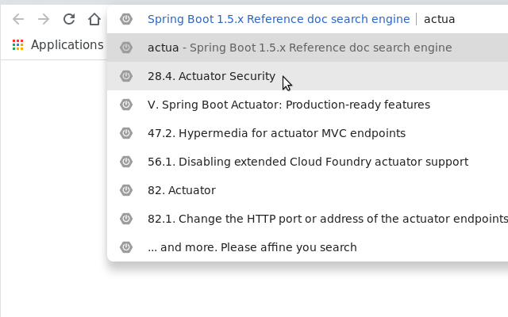

# springbootdoc-chrome-extension

Google Chrome extension to search Spring Boot doc from the omnibox.

## Installation
### From Chrome Web Store directly
once accepted in the store...

[direct link](https://chrome.google.com/webstore/search/Spring%20Boot%201.5.x%20Reference%20doc%20search%20engine?hl=fr)

### Locally
Go to : 
    
    chrome://extensions/
    
activate the developper mode    
then load this folder.

## Development

https://developer.chrome.com/extensions/omnibox

Just run : 

	$ ant
	Buildfile: <..>/springbootdoc/build.xml

	dist:
	      [zip] Building zip: <..>/dist/springbootdoc_1.5.zip
	      [zip] Building zip: <..>/dist/springbootdoc_2.zip

	
to build both extensions : for [Spring Boot 1.5.x](https://docs.spring.io/spring-boot/docs/1.5.x/reference/htmlsingle/index.html) doc and for [Spring Boot 2](https://docs.spring.io/spring-boot/docs/current/reference/htmlsingle/)

## Miscellaneous

Useful Chrome shortcut :

* Jump to the address bar : `Ctrl + l or Alt + d or F6`

https://support.google.com/chrome/answer/157179?hl=en

## Adapt to another site

You can change the `BASE_URI` in `background.js` to adapt to other site.
You also have to update the `manifest.json` to adapt the permissions 
 
     "permissions": [
        "...${ROOT of BASE_URI}..."
      ]

Spring Boot logo trademark  : https://spring.io/trademarks
